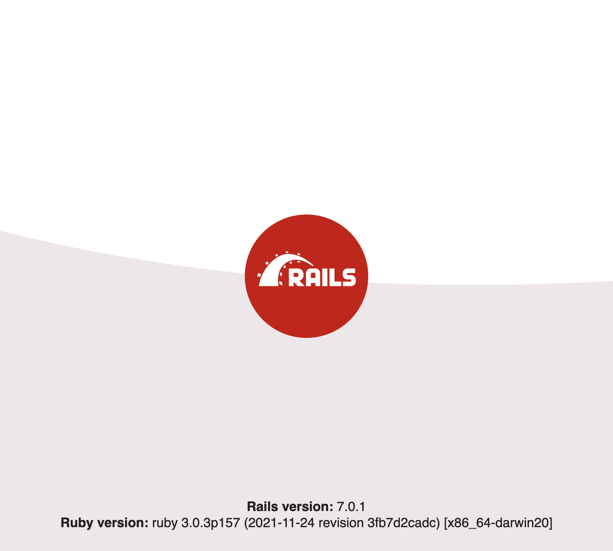

# Daily Tech Challenge #8 

For today's tech challenge, I'm installing and configuring rails to see how much
I can get done with the framework in a day. I don't have experience with Rails,
but I do have experience with Ruby, so hopefully that will come in handy.

So far, I achieved the following:

I did that by running `rails new dtc0008` followed by `rails serve`. Please,
hold the applause.
